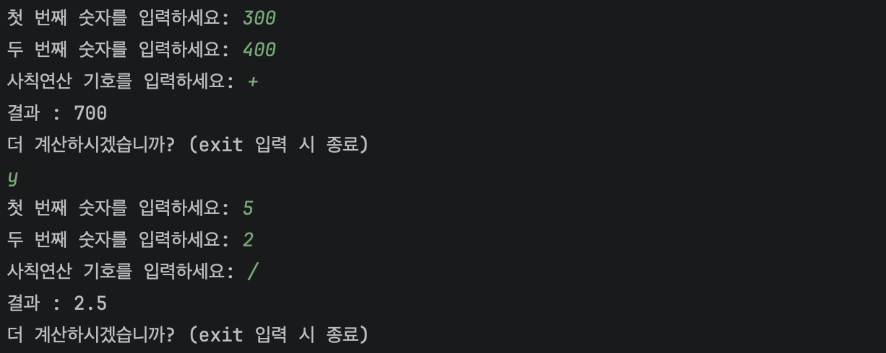
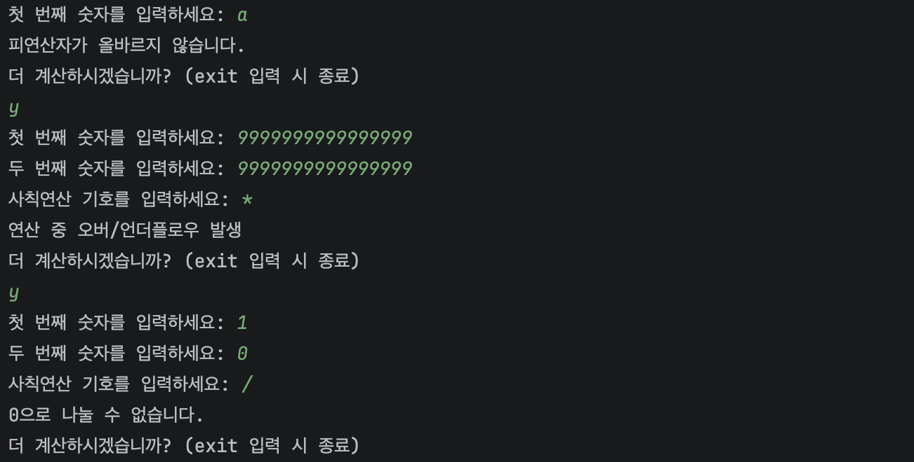

# 계산기 프로그램 🧮
___
콘솔 기반 계산기 프로그램입니다

## 💻 프로젝트 소개
___
내일배움캠프 CH2 과제 수행 목적으로 구현한 프로그램입니다.

요구사항 분석을 통해 사칙 연산 및 예외 처리 등의 주요 기능들을 구현합니다.
<br>
현재 STEP1 <클래스 없이 기본적인 연산 구현하기>입니다.

각 STEP별로 릴리즈 노트 발행할 예정입니다.

## 👨‍💻개발 기간 및 기술 스택
___
### 개발 기간
- 2026.09.16일

### 기술 스택
- JDK 17
- IntelliJ
- Git / GitHub

## 📌 주요 기능
___
### 1. 정수 사칙 연산
- **기본 연산** : 정수의 덧셈, 뺄셈, 곱셈, 나눗셈 수행

### 2. 입력 및 예외처리
- **2개의 정수** [입력] : 타입 및 범위 체크
- **1개의 연산자** [입력] : 문자(+, -, *, /, %) 체크
- **연산 오버플로우** : 각 연산 간 오버플로우 여부 체크
- **N/0 체크**
- **Scanner 버퍼 체크**

## 📺 실행 화면
___
**정상 로직**



**예외 발생**



## 🕹️ 실행 방법
___
**JDK17 이상** 설치 필수

- 프로젝트 폴더 복제 후 이동
```
git clone https://github.com/GreenAbocado/calculator
cd calculator/src
```

- 컴파일 및 실행
```
javac Main.java
java Main
```

## 📁 폴더 구조
___

```
.
├── .github/
│   └── PULL_REQUEST_TEMPLATE/
│       └── default-review.md
├── images/
│   ├── screenshot_fail.png
│   └── screenshot_success.png
├── src/
│   └── Main.java
├── .gitignore
└── README.md
```